 

  

 

## 🛠️ Tech Stack

 

## 🚀 Featured Projects

<table>
<tr>
<td width="33%" align="center">

### 🌐
**Full Stack App**
 
End-to-end web application

</td>
<td width="33%" align="center">

### ⚡
**Embedded Systems**
 
Hardware + firmware project

</td>
<td width="33%" align="center">

### 🤖
**AI / ML**
 
Machine learning experiment

</td>
</tr>
</table>

 

## 📊 GitHub Stats

⚠️ These run on the free public `vercel.app` demo instance, which gets rate-limited under heavy traffic and can show a broken icon at random. If it keeps happening, self-hosting your own copy (fork the repo → deploy to your own Vercel) fixes it permanently.

 

## 🌌 3D Contribution Graph

> ⚙️ This image won't appear until you add **`profile-3d-contrib.yml`** to `.github/workflows/` in your `chala-tech/chala-tech` repo and let it run once (Actions tab → run manually). After that it regenerates itself daily.

 

  

